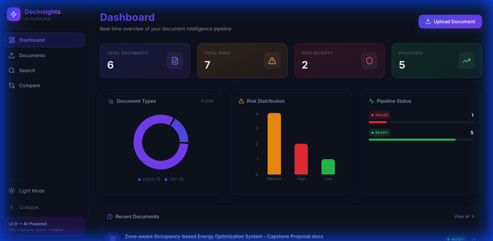

<p align="center">
  
</p>

<h1 align="center">⚡ DocInsights — AI Document Intelligence Platform</h1>

<p align="center">
  <strong>Upload documents. Ask questions. Get AI-powered insights in seconds.</strong>
</p>

<p align="center">
  <a href="https://frontend-ten-gamma-11.vercel.app">🌐 Live Demo</a> •
  <a href="https://docinsights-production.up.railway.app/docs">📖 API Docs</a> •
  <a href="#features">✨ Features</a> •
  <a href="#tech-stack">🛠 Tech Stack</a> •
  <a href="#quick-start">🚀 Quick Start</a>
</p>

<p align="center">
  
  
  
  
  
</p>

---

## 🌐 Live Deployment

| Service | URL |
|---------|-----|
| **Frontend** (Vercel) | [frontend-ten-gamma-11.vercel.app](https://frontend-ten-gamma-11.vercel.app) |
| **Backend API** (Railway) | [docinsights-production.up.railway.app](https://docinsights-production.up.railway.app) |
| **API Documentation** | [Swagger UI](https://docinsights-production.up.railway.app/docs) |
| **Health Check** | [/api/health](https://docinsights-production.up.railway.app/api/health) |

---

## ✨ Features

### 📄 Document Management
- **Multi-format upload** — PDF, DOCX, TXT with drag-and-drop support
- **OCR support** — Extract text from scanned documents using Tesseract
- **Real-time processing** — Automatic chunking, embedding, and indexing on upload
- **Status tracking** — Live pipeline status (uploading → chunking → embedding → ready)

### 🔍 Semantic Search
- **AI-powered similarity search** across all uploaded documents
- **FAISS vector store** with auto-upgrade from flat index to IVF at scale
- **Relevance scoring** with visual score bars for each result
- **Document-scoped search** — search within a specific document or across all

### 💬 Chat with Documents (RAG)
- **Retrieval-Augmented Generation** — ask questions, get answers with source citations
- **Context-aware conversations** — maintains chat history per document
- **Source transparency** — see exactly which chunks informed each answer with relevance scores
- **Copy-to-clipboard** — one-click copy for any AI response

### 📊 AI-Powered Insights
- **Executive Summaries** — auto-generated document summaries with key takeaways
- **Risk Detection** — automated risk scoring with severity levels (High / Medium / Low)
- **Key Information Extraction** — legal, financial, and research-specific data extraction
- **Tabbed Insights View** — overview, full text, and AI insights in a clean interface

### ⚖️ Multi-Document Comparison
- **Side-by-side analysis** — compare up to 5 documents simultaneously
- **AI-generated differences** — similarities and differences highlighted automatically
- **Comparison summary** — high-level overview of what the documents share and where they diverge

### 📈 Analytics Dashboard
- **Animated stat cards** — document count, risk totals, severity breakdown
- **Interactive charts** — donut chart for document types, bar chart for risk distribution
- **Pipeline progress bars** — visual status of all documents in the system
- **Recent documents feed** — quick access to latest uploads with status badges

---

## 🛠 Tech Stack

### Backend
| Component | Technology |
|-----------|-----------|
| **Framework** | FastAPI with async SQLAlchemy |
| **LLM** | OpenRouter (OpenAI-compatible API) |
| **Embeddings** | SentenceTransformers (`all-MiniLM-L6-v2`) |
| **Vector Store** | FAISS (auto-upgrades flat → IVF at 256+ vectors) |
| **Database** | SQLite (dev) / PostgreSQL (prod) |
| **Workers** | Celery + Redis |
| **Caching** | In-memory LRU (LLM responses + query embeddings) |

### Frontend
| Component | Technology |
|-----------|-----------|
| **Framework** | React 18 + Vite |
| **Styling** | Tailwind CSS with custom CSS variables |
| **Charts** | Recharts |
| **Icons** | Lucide React |
| **HTTP Client** | Axios |
| **Routing** | React Router v6 |

### Infrastructure
| Component | Technology |
|-----------|-----------|
| **Frontend Hosting** | Vercel (with API rewrites) |
| **Backend Hosting** | Railway (Nixpacks) |
| **CI/CD** | Git push → auto-deploy |

---

## 🏗 Architecture

```
┌─────────────────────────────────────────────────────────────────┐
│                        VERCEL (Frontend)                        │
│  React 18 + Vite + Tailwind CSS                                 │
│  /api/* → rewrites to Railway backend                           │
└──────────────────────────┬──────────────────────────────────────┘
                           │ HTTPS
┌──────────────────────────▼──────────────────────────────────────┐
│                       RAILWAY (Backend)                         │
│  ┌──────────────────────────────────────────────────────────┐   │
│  │  FastAPI Application                                     │   │
│  │  ├── api/          → REST endpoints (documents, chat,    │   │
│  │  │                  search, compare, insights, dashboard)│   │
│  │  ├── services/     → Business logic                      │   │
│  │  │   ├── llm_client.py      → LLM with retry + cache     │   │
│  │  │   ├── rag_service.py     → RAG pipeline orchestration │   │
│  │  │   ├── vector_store.py    → FAISS index management     │   │
│  │  │   ├── embedding_service.py → Query embedding + cache  │   │
│  │  │   └── document_processor.py → Text extraction         │   │
│  │  ├── models/       → SQLAlchemy ORM + Pydantic schemas   │   │
│  │  └── utils/        → Text processing, file validation    │   │
│  └──────────────────────────────────────────────────────────┘   │
│                           │                                     │
│  ┌────────────────┐  ┌────▼───────────┐  ┌──────────────────┐   │
│  │   SQLite DB    │  │ FAISS Index    │  │ LLM (OpenRouter) │   │
│  │  (documents,   │  │ (embeddings,   │  │ (GPT-3.5-turbo)  │   │
│  │   chunks,      │  │  similarity    │  │                  │   │
│  │   insights,    │  │  search)       │  │                  │   │
│  │   chat history)│  │                │  │                  │   │
│  └────────────────┘  └────────────────┘  └──────────────────┘   │
└─────────────────────────────────────────────────────────────────┘
```

---

## 🚀 Quick Start

### Prerequisites
- Python 3.11+
- Node.js 18+
- An OpenAI-compatible API key (e.g., [OpenRouter](https://openrouter.ai))

### 1. Clone & Configure

```bash
git clone https://github.com/aditya-3526/DocInsights.git
cd DocInsights
cp .env.example .env
```

Edit `.env` and set your API key:
```env
OPENAI_API_KEY=your-api-key-here
OPENAI_API_BASE=https://openrouter.ai/api/v1
OPENAI_MODEL=openai/gpt-3.5-turbo
```

### 2. Backend Setup

```bash
python -m venv venv
source venv/bin/activate  # Windows: venv\Scripts\activate
pip install -r requirements.txt
uvicorn backend.main:app --reload --port 8000
```

API docs at: [http://localhost:8000/docs](http://localhost:8000/docs)

### 3. Frontend Setup

```bash
cd frontend
npm install
npm run dev
```

App running at: [http://localhost:5173](http://localhost:5173)

### 4. (Optional) Celery Workers

```bash
# Requires Redis on localhost:6379
celery -A backend.workers.celery_app worker --loglevel=info
```

---

## 🐳 Docker Deployment

```bash
cp .env.example .env
# Edit .env with your settings
docker-compose up --build
```

| Service | URL |
|---------|-----|
| Frontend | http://localhost:3000 |
| Backend | http://localhost:8000 |
| API Docs | http://localhost:8000/docs |

---

## ⚙️ Environment Variables

| Variable | Description | Default |
|----------|-------------|---------|
| `OPENAI_API_KEY` | OpenAI / OpenRouter API key | — (required) |
| `OPENAI_API_BASE` | LLM API base URL | `https://api.openai.com/v1` |
| `OPENAI_MODEL` | LLM model identifier | `gpt-3.5-turbo` |
| `DATABASE_URL` | Database connection string | `sqlite+aiosqlite:///./data/app.db` |
| `EMBEDDING_MODEL` | SentenceTransformer model | `all-MiniLM-L6-v2` |
| `MAX_FILE_SIZE_MB` | Max upload file size | `50` |
| `REDIS_URL` | Redis URL for Celery | `redis://localhost:6379/0` |
| `CORS_ORIGINS` | Allowed CORS origins | `http://localhost:5173` |

---

## 📁 Project Structure

```
DocInsights/
├── backend/
│   ├── api/                  # REST API endpoints
│   │   ├── documents.py      # Upload, list, delete, get document
│   │   ├── chat.py           # RAG chat with documents
│   │   ├── search.py         # Semantic search
│   │   ├── compare.py        # Multi-document comparison
│   │   ├── insights.py       # Summarize, extract, risk detection
│   │   └── dashboard.py      # Analytics & stats
│   ├── services/             # Business logic layer
│   │   ├── llm_client.py     # LLM wrapper with retry + cache
│   │   ├── rag_service.py    # RAG pipeline orchestration
│   │   ├── vector_store.py   # FAISS index (flat → IVF auto-upgrade)
│   │   ├── embedding_service.py  # Embeddings with query cache
│   │   ├── document_processor.py # PDF/DOCX/TXT text extraction
│   │   ├── prompts.py        # Centralized prompt templates
│   │   └── response_parser.py    # JSON parsing + validators
│   ├── models/               # SQLAlchemy models + Pydantic schemas
│   ├── utils/                # Text processing, file validation
│   ├── workers/              # Celery background tasks
│   ├── config.py             # App configuration
│   ├── database.py           # Database engine & sessions
│   └── main.py               # FastAPI app entry point
├── frontend/
│   ├── src/
│   │   ├── components/       # Reusable UI components
│   │   │   ├── ui.jsx        # AnimatedCounter, StatusBadge, Skeleton
│   │   │   └── Toast.jsx     # Toast notification system
│   │   ├── pages/            # Page components
│   │   │   ├── DashboardPage.jsx
│   │   │   ├── UploadPage.jsx
│   │   │   ├── DocumentPage.jsx
│   │   │   ├── ChatPage.jsx
│   │   │   ├── SearchPage.jsx
│   │   │   └── ComparePage.jsx
│   │   ├── services/api.js   # Axios API client
│   │   ├── App.jsx           # Layout + routing
│   │   └── index.css         # Theme system + animations
│   ├── vercel.json           # Vercel deployment config
│   └── vite.config.js        # Vite config with dev proxy
├── tests/                    # Pytest test suite
├── docker/                   # Dockerfiles + nginx config
├── Procfile                  # Railway start command
├── railway.json              # Railway deployment config
└── requirements.txt          # Python dependencies
```

---

## 🧪 Testing

```bash
pip install pytest pytest-asyncio
python -m pytest tests/ -v
```

---

## 🚢 Deployment Guide

### Vercel (Frontend)
```bash
cd frontend
npm i -g vercel
vercel --yes --prod
```

### Railway (Backend)
```bash
npm i -g @railway/cli
railway login
railway init
railway up
railway domain  # Generate public URL
```

Set environment variables:
```bash
railway variables set OPENAI_API_KEY=your-key OPENAI_API_BASE=https://openrouter.ai/api/v1
```

---

## 📄 License

MIT — free for personal and commercial use.

---

<p align="center">
  Built with ❤️ by <a href="https://github.com/aditya-3526">Aditya Aryan</a>
</p>
